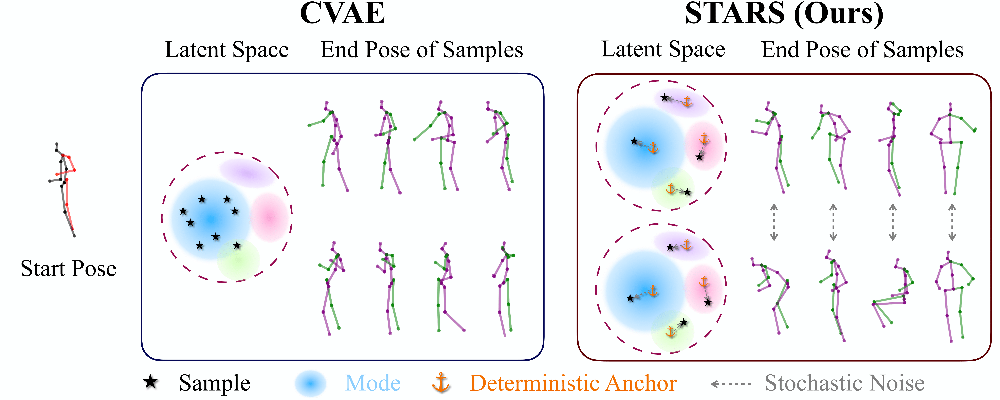

# Diverse Human Motion Prediction Guided by Multi-Level *S*patial-*T*emporal *A*ncho*RS*

---
This repo contains the official implementation of the paper:

Diverse Human Motion Prediction Guided by Multi-Level Spatial-Temporal Anchors

Sirui Xu, Yu-Xiong Wang*, Liang-Yan Gui*

ECCV 2022 (**oral**)

[[website]()] [[paper]()] [[talk]()] [[demo](https://youtu.be/ibYfsvCg7tQ)]


## Citation
If you find this work useful in your research, please cite:

```bibtex
@inproceedings{xu22stars,
  title     = {Diverse Human Motion Prediction Guided by Multi-Level Spatial-Temporal Anchors},
  author    = {Xu, Sirui and Wang, Yu-Xiong and Gui, Liang-Yan},
  booktitle = {European Conference on Computer Vision (ECCV)},
  year      = {2022}
}
```

## License

This repo is distributed under an [MIT LICENSE](LICENSE)